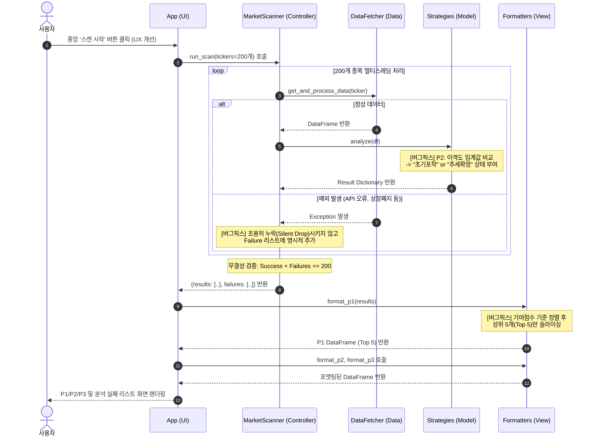
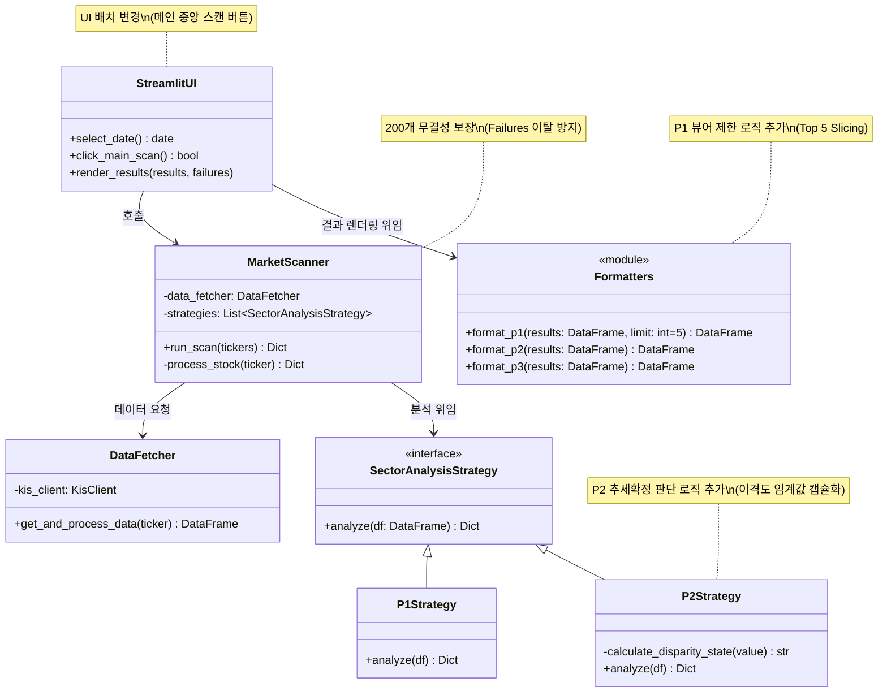

### 1. 동적 모델링: 시퀀스 다이어그램 (Sequence Diagram)

사용자가 메인 화면에서 '스캔 시작' 버튼을 누른 시점부터 4가지 이슈가 해결되어 화면에 렌더링되기까지의 데이터 제어 흐름(Control Flow)을 보여줍니다.

* **설계 포인트:** * `MarketScanner`에서 정상 데이터와 실패 데이터를 모두 수집하여 200개 유실 방지(무결성)를 보장합니다.
* P1 종목의 **Top 5 필터링**은 비즈니스 로직(Model)이 아닌 포맷터(View) 계층에서 안전하게 수행됩니다.

---

### 2. 정적 모델링: 클래스 다이어그램 (Class Diagram)

Hotfix V4.2 패치가 적용된 시스템의 정적 구조입니다. 각 클래스가 단일 책임 원칙(SRP)을 준수하도록 책임을 명확히 분리했습니다.

* **설계 포인트:**
* **의존성 역전 원칙 (DIP):** `MarketScanner`는 구체적인 전략 클래스(`P1`, `P2`)를 알지 못하고, 추상화된 `SectorAnalysisStrategy` 인터페이스에만 의존합니다.
* **뷰 필터 패턴 (View Filter):** `format_p1` 함수에 `limit` 파라미터(또는 내부 로직)를 추가하여 View 레벨에서 데이터를 가공합니다.

